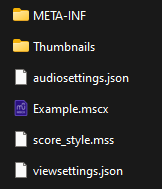

# Guide to MuseScore save files
*Tested in MuseScore 4*

## .mscz and .mscx Files

When saving a score in MuseScore, the save file type is .mscz. This is a compressed file that stores the score and metadata about the score. Uncompressing the file leaves the following:

*The above score was named "Example"*

For now, we will ignore everything in this directory except for the .mscx file.

The .mscx file is just an xml doc that describes the actual score made in MuseScore. Since MuseScore will open .mscx file directly, all we need to do to generate music through code is generate this xml file.

The following sections of this guide will dive deep into the .mscx file's schema to determine how MuseScore scores can be generated.

## 
