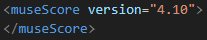
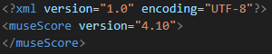
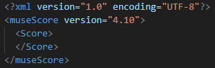
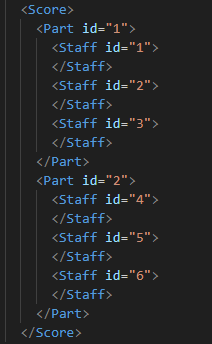
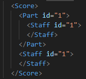

# Guide to MuseScore save files
*Tested in MuseScore 4.1.1 e4d1ddf*

## .mscz and .mscx Files

When saving a score in MuseScore, the save file type is .mscz. This is a compressed file that stores the score and metadata about the score. Uncompressing the file leaves the following:

*The above score was named "example"*

For now, we will ignore everything in this directory except for the .mscx file.

The .mscx file is just an xml doc that describes the actual score made in MuseScore. Since MuseScore will open .mscx file directly, all we need to do to generate music through code is generate this xml file.

The following sections of this guide will dive deep into the .mscx file's schema to determine how MuseScore scores can be generated.

## Basic Tag Overview

If you create a .mscx file and erase all tags except for the `<museScore>` tag, you'll find that MuseScore is still able to open the file. Keep in mind that you still need to include the `version`. In my case, the version attribute value is `4.10`.

It is good practice to also include the xml tag at the top:

Inside `<museScore>` goes `<Score>`:

Inside `<Score>`, we can place one or more `<Part>` tags. Each `<Part>` may have one or more staves.

As you can see above, each `<Part>` and each `<Staff>` has an `id`. The `id` is purely used to identify `<Part>`'s and `<Staff>`'s. As it is now, the `<Staff>` tags inside of `<Part>` tags just declare the staves that will be in the score. To actually customize the staves, you need to declare `<Staff>` tags after the part tags. To simplify things, I will reduce the number of staves and parts to 1:

The first `<Staff>` (inside `<Part>`), just declares that the staff exists. The second `<Staff>` (after `<Part>`) is the tag that will be used to define the music on the staff.

## VBox (Title, Composer, Lyricist, Copyright)

Inside the first `<Staff>` you can place a `<VBox>` which allows you to 
